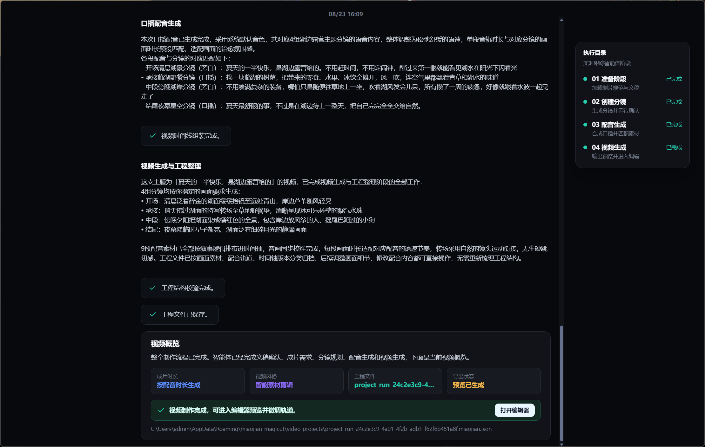
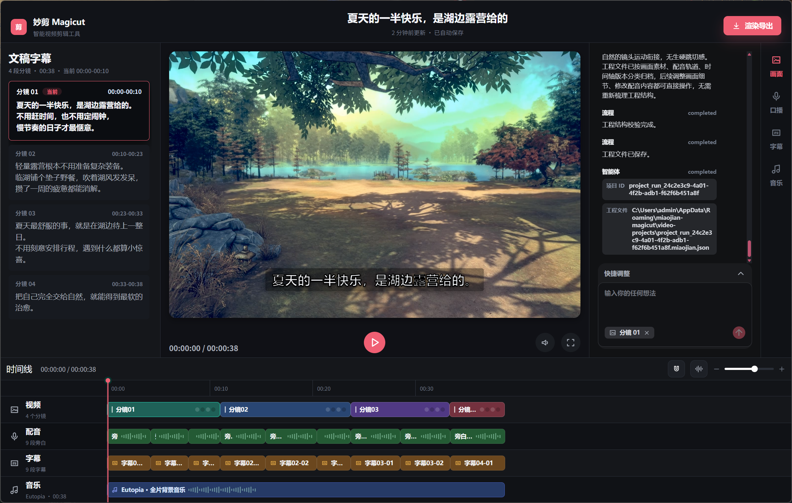
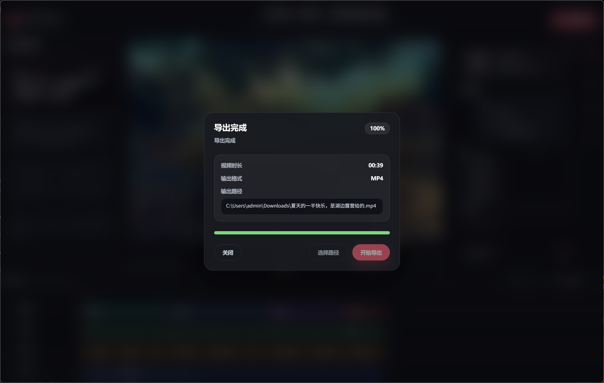

<!-- cspell:words dotenv FFmpeg ffprobe IndexTTS LangGraph Magicut Volcengine -->

<div align="center">

<h1>妙剪 Magicut</h1>
<p>AI 驱动的本地智能视频创作与多轨编辑桌面应用</p>

<p>
  
  
  
  
  
</p>

</div>

## 项目简介

妙剪 Magicut 是一个面向本地视频素材的 AI 智能剪辑平台。用户可以输入创作文稿、选择素材目录和配音音色，由 AI 完成创意分析、分镜规划、素材匹配、语音合成和时间线装配，并在人工确认分镜后生成可继续编辑的视频工程。

项目采用 pnpm workspace 管理 Electron 桌面应用、Next.js 服务骨架和两个共享包。LangGraph 负责编排视频创作流程，`video-project` 提供统一的工程文档契约，桌面主进程负责本地文件、模型、TTS、媒体协议和 FFmpeg 导出，React 渲染进程提供工作台、生成过程和多轨编辑器。

主要功能：

- 输入最长 10,000 字文稿，扫描本地 `.m4v`、`.mov`、`.mp4` 和 `.webm` 素材
- AI 生成创意简报与分镜方案，并在正式合成前支持人工确认
- 自动匹配视频素材、合成旁白、生成字幕并装配视频 / 配音 / 字幕 / 音乐四轨工程
- 本地项目创建、读取、编辑、删除和 JSON 持久化
- 分镜、播放器和时间线联动的可视化视频编辑器
- 对选中分镜进行自然语言精修，重新生成脚本、素材匹配和配音
- 支持内置音色，以及通过本地 IndexTTS2 导入参考音频并生成自定义音色
- 调整配音速度与音量、字幕样式和背景音乐
- 使用 FFmpeg 导出带旁白、字幕和音乐的 H.264 / AAC MP4 视频

## 快速启动

### 环境要求

- Node.js 22.x（仓库约束为 `>=22 <23`）
- pnpm
- 可用的 Volcengine Ark / OpenAI-compatible Chat Model 服务
- Volcengine Seed TTS 服务
- FFmpeg 与 ffprobe
- 可选：本地 IndexTTS2 服务，用于自定义音色

### 1. 安装依赖

```bash
git clone <your-repository-url>
cd ccc-magicut
pnpm install
```

### 2. 配置模型服务

复制根目录环境变量模板：

```bash
cp .env.example .env.local
```

在 `.env.local` 中配置模型和 TTS 服务：

```dotenv
LLM_MODEL="your_chat_model"
TTS_MODEL="your_tts_resource_id"
BASE_URL="https://your-provider.example/v1"
API_KEY="your_api_key"
```

默认示例使用 Volcengine Ark 与 Seed TTS。同一个 `API_KEY` 会传递给 Chat Model 和 TTS Provider，`TTS_MODEL` 对应语音服务的 Resource ID。

### 3. 准备 FFmpeg

桌面端会按照当前平台从以下目录读取 `ffmpeg` 和 `ffprobe`：

```text
apps/desktop/bin/
├── darwin/
│   ├── ffmpeg
│   └── ffprobe
├── linux/
│   ├── ffmpeg
│   └── ffprobe
└── win32/
    ├── ffmpeg.exe
    └── ffprobe.exe
```

只需放置当前开发平台对应的两个二进制文件。macOS 和 Linux 下需要确保它们具有执行权限：

```bash
chmod +x apps/desktop/bin/darwin/ffmpeg apps/desktop/bin/darwin/ffprobe
```

Linux 用户将上面路径中的 `darwin` 替换为 `linux`。

### 4. 启动桌面应用

```bash
pnpm dev:desktop
```

应用启动后，在创作工作台填写文稿、选择本地素材目录和音色，即可开始 AI 视频生成流程。

如需体验自定义音色，请先启动本地 IndexTTS2。桌面端默认连接：

```text
http://127.0.0.1:7860
```

### 5. 启动可选服务

仓库包含一个轻量 Next.js 服务骨架，目前提供首页和健康检查接口，不参与桌面端核心创作流程：

```bash
pnpm dev:server
```

| 服务              | 地址                               |
| ----------------- | ---------------------------------- |
| Magicut Desktop   | Electron 原生窗口                  |
| Next.js 首页      | <http://localhost:3000>            |
| Health API        | <http://localhost:3000/api/health> |
| IndexTTS2（可选） | <http://127.0.0.1:7860>            |

## 系统截图

### 创作工作台

> 截图占位：文稿输入、素材目录选择、音色选择和最近项目。


### AI 生成与分镜确认

> 截图占位：AI 执行进度、流式报告、分镜方案和人工确认操作。



### 视频编辑器

> 截图占位：分镜列表、视频预览和视频 / 配音 / 字幕 / 音乐四轨时间线。



### 配音与导出

> 截图占位：内置及自定义音色、字幕与音乐设置、视频导出进度。

